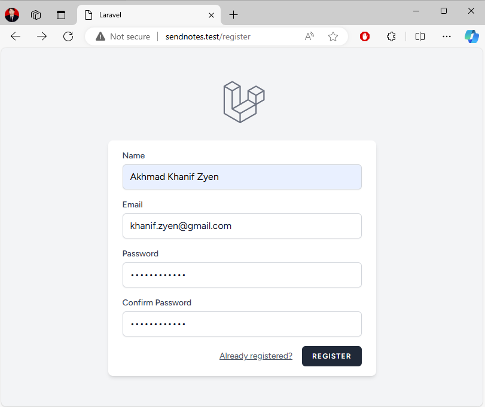
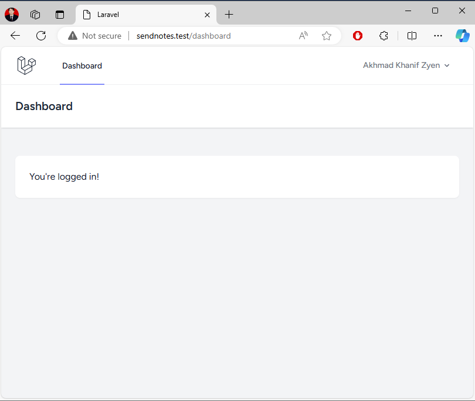
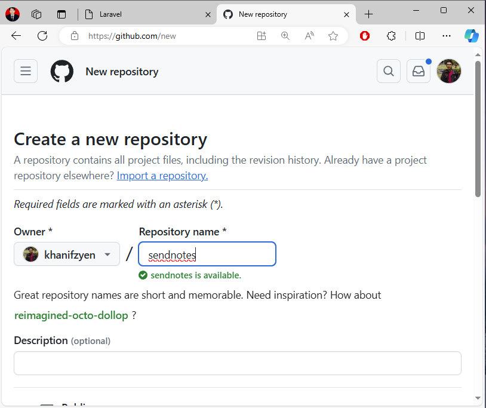

# Introduction and setup

Diambil dari: https://www.youtube.com/watch?v=Ul3sfSDEt9U

1. Diasumsikan anda menggunakan laragon untuk development environment. Pastikan anda sudah menambahkan PHP 8.3.x karena merupakan requirement yang dibutuhkan oleh Laravel.

2. Buka `cmd`, pastikan anda berada pada folder `laragon` (atau webserver lain yang anda gunakan). Ada baiknya semua project jangan ditaruh di folder `www`, tetapi diluar itu, contoh `src`

    ```bash
    C:\Users\User>d:
    D:\>cd laragon
    D:\laragon>mkdir src
    D:\laragon>cd src
    ```

3. Install laravel

    ```bash
    composer global require laravel/installer
    laravel new sendnotes
    ```

4. Selanjutnya anda perlu melakukan konfigurasi awal, pilih pilihan berikut:

    ```bash
    Would you like to install a starter kit? [No starter kit]:
    [none     ] No starter kit
    [breeze   ] Laravel Breeze
    [jetstream] Laravel Jetstream
    > breeze

    Which Breeze stack would you like to install? [Blade with Alpine]:
    [blade              ] Blade with Alpine
    [livewire           ] Livewire (Volt Class API) with Alpine
    [livewire-functional] Livewire (Volt Functional API) with Alpine
    [react              ] React with Inertia
    [vue                ] Vue with Inertia
    [api                ] API only
    > livewire

    Would you like dark mode support? (yes/no) [no]:
    > yes

    Which testing framework do you prefer? [Pest]:
    [0] Pest
    [1] PHPUnit
    > 0

    Would you like to initialize a Git repository? (yes/no) [no]:
    > yes

    Which database will your application use? [MySQL]:
    [mysql  ] MySQL
    [mariadb] MariaDB
    [sqlite ] SQLite (Missing PDO extension)
    [pgsql  ] PostgreSQL (Missing PDO extension)
    [sqlsrv ] SQL Server (Missing PDO extension)
    > sqlite

    Would you like to run the default database migrations? (yes/no) [yes]:
    > yes
    ```

    > Pastikan anda sudah memasang extensions PHP untuk sqlite. (`pdo_sqlite`)

5. Buat blank project di laragon dengan memilih Quick App -> Blank, kemudian masukkan nama project `sendnotes`

6. Buka di browser http://sendnotes.test

7. Kembali di `cmd`, pastikan anda berada pada folder `sendnotes`, jalankan perintah `npm run dev`

8. Buka project `sendnotes` di vscode, kemudian edit file `.env`, ubah nilai `APP_URL=http://sendnotes.test`

9. Buka project `sendnotes` di browser, pilih Register, isikan akun baru anda


Gambar 1. Tampilan Register


Gambar 2. Tampilan Dashboard

10. Buat repository baru di github, beri nama `sendnotes`


Gambar 3. Membuat Repo Baru `sendnotes` di Github

11. Buka `terminal` pada vscode di project `sendnotes`, jalankan perintah berikut untuk menambahkan remote repository

    ```bash
    D:\laragon\src\sendnotes> git remote add origin https://github.com/khanifzyen/sendnotes.git
    ```
